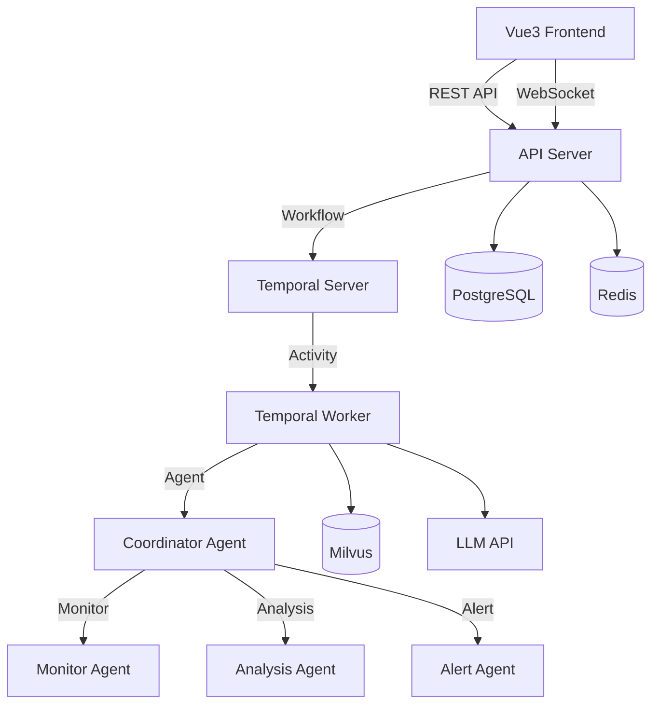

# AiOpsHub 项目优化建议报告

**生成日期**: 2026-07-07
**项目版本**: v1.0
**分析范围**: 后端Go代码、前端Vue3代码、架构设计、安全性、性能、测试覆盖

---

## 一、执行摘要

本项目已完成核心功能开发，包含AI对话系统、RAG知识检索、MCP工具集成、智能Agent路由等关键模块。通过全面的代码审查，我们发现了33个关键问题，其中：
- **高严重度**: 7个（21%）
- **中严重度**: 16个（48%）
- **低严重度**: 10个（30%）

**核心问题**：
1. 配置文件敏感信息暴露（数据库密码、API密钥等）
2. 测试覆盖率严重不足（仅9个测试文件）
3. 缺少CI/CD自动化流程
4. 性能优化和缓存策略缺失
5. 前端Token存储安全性问题

**优化价值**：
- 解决安全问题可防止数据泄露和系统攻击
- 提升测试覆盖率可降低重构风险和部署故障率
- 性能优化可提升用户体验和系统稳定性
- 完善文档可降低维护成本和新人上手难度

---

## 二、高优先级优化项（立即执行）

### 2.1 安全问题修复（严重性：高）

#### 问题1: 配置文件敏感信息泄露

**现状**：
- `backend/configs/config.yaml` 包含明文存储的数据库密码、Redis密码、API密钥和JWT密钥
- 真实的IP地址暴露了内部网络架构
- 生产级密钥直接写入配置文件

**影响**：
- 数据库安全：PostgreSQL和Redis可被直接连接
- LLM服务安全：阿里云百炼API密钥泄露可能导致费用损失
- JWT安全：可伪造任意用户token

**优化方案**：

```yaml
# 方案1: 使用环境变量（推荐）
database:
  host: ${DATABASE_HOST}
  port: ${DATABASE_PORT}
  user: ${DATABASE_USER}
  password: ${DATABASE_PASSWORD}
  
llm:
  api_key: ${LLM_API_KEY}
  
jwt:
  secret: ${JWT_SECRET_KEY}

# 方案2: 使用配置文件模板 + .env文件
# 创建 backend/configs/config.yaml.example（模板文件）
# 创建 .env文件存储真实密钥（不提交到git）
# 启动时加载 .env 覆盖配置
```

**实施步骤**：
1. 创建 `backend/configs/config.yaml.example` 作为配置模板
2. 将真实配置文件 `backend/configs/config.yaml` 添加到 `.gitignore`
3. 使用环境变量或密钥管理系统（如Vault）管理敏感信息
4. 在部署文档中说明配置方法

**文件修改**：
- 新增: `backend/configs/config.yaml.example`
- 修改: `backend/configs/config.yaml` (添加到.gitignore)
- 修改: `backend/internal/config/config.go` (支持环境变量覆盖)

**工作量**: 2小时
**优先级**: P0（立即修复）

---

#### 问题2: JWT认证实现安全隐患

**现状**：
- JWT密钥硬编码：`aiops-jwt-secret-key-2024`（过于简单）
- 无密钥轮换机制
- Redis故障时JWT验证安全性降低（无blacklist机制）

**优化方案**：

```go
// 1. 强密钥生成（至少256位）
func GenerateJWTSecret() string {
    return uuid.New().String() + "-" + time.Now().Unix()
}

// 2. 密钥轮换机制（建议90天轮换）
type JWTKeyManager struct {
    currentKey  string
    previousKey string
    rotateTime  time.Time
}

// 3. 完善Token Blacklist机制
func ValidateToken(tokenString string) (*Claims, error) {
    // 先检查blacklist
    if isBlacklisted(tokenString) {
        return nil, errors.New("token is blacklisted")
    }
    
    // 尝试当前密钥验证
    claims, err := validateWithKey(tokenString, currentKey)
    if err != nil {
        // 尝试前一个密钥（支持密钥轮换过渡期）
        claims, err = validateWithKey(tokenString, previousKey)
    }
    
    return claims, err
}
```

**实施步骤**：
1. 生成强密钥并存储在环境变量
2. 实现密钥轮换机制
3. 完善Token Blacklist逻辑
4. 添加密钥管理文档

**工作量**: 4小时
**优先级**: P0（立即修复）

---

#### 问题3: Docker配置包含硬编码密码

**现状**：
- `deployments/docker-compose.yml` 包含明文密码
- PostgreSQL: `aiops123`
- Grafana: `admin123`
- MinIO: `minioadmin/minioadmin`

**优化方案**：

```yaml
# 使用环境变量
services:
  postgres:
    environment:
      POSTGRES_PASSWORD: ${POSTGRES_PASSWORD:-changeme}
      
  grafana:
    environment:
      GF_SECURITY_ADMIN_PASSWORD: ${GRAFANA_PASSWORD:-admin123}
      
# 或使用Docker Secrets
services:
  postgres:
    secrets:
      - postgres_password
      
secrets:
  postgres_password:
    file: ./secrets/postgres_password.txt
```

**实施步骤**：
1. 创建 `deployments/.env` 文件存储密钥
2. 修改 docker-compose.yml 使用环境变量
3. 创建 `deployments/docker-compose.yml.example` 模板
4. 在部署文档中说明密钥配置方法

**工作量**: 2小时
**优先级**: P0（立即修复）

---

#### 问题4: CORS配置过于宽松

**现状**：
- CORS允许所有来源：`Access-Control-Allow-Origin: *`
- 允许携带凭证：`Access-Control-Allow-Credentials: true`

**优化方案**：

```go
func CORS() gin.HandlerFunc {
    return func(c *gin.Context) {
        // 从配置读取允许的域名列表
        allowedOrigins := viper.GetStringSlice("cors.allowed_origins")
        origin := c.GetHeader("Origin")
        
        if contains(allowedOrigins, origin) {
            c.Header("Access-Control-Allow-Origin", origin)
        } else {
            // 生产环境拒绝未知来源
            c.AbortWithStatus(403)
            return
        }
        
        c.Header("Access-Control-Allow-Methods", "GET,POST,PUT,DELETE,OPTIONS")
        c.Header("Access-Control-Allow-Headers", "Content-Type,Authorization")
        c.Header("Access-Control-Allow-Credentials", "true")
        c.Header("Access-Control-Max-Age", "86400")
        
        if c.Request.Method == "OPTIONS" {
            c.AbortWithStatus(204)
            return
        }
        
        c.Next()
    }
}

// config.yaml
cors:
  allowed_origins:
    - "https://aiops.example.com"
    - "http://localhost:5173"  # 开发环境
```

**工作量**: 2小时
**优先级**: P1（本周修复）

---

#### 问题5: 前端Token存储安全性问题

**现状**：
- Token直接存储在localStorage（易被XSS攻击）
- 用户信息未加密存储

**优化方案**：

```typescript
// 方案1: 使用HttpOnly Cookie（推荐）
// 后端设置Cookie
func Login(c *gin.Context) {
    token := generateJWT(user)
    
    // 设置HttpOnly Cookie（无法被JS读取，防止XSS）
    c.SetCookie("auth_token", token, 86400, "/", "", true, true)
    
    c.JSON(200, gin.H{
        "message": "Login successful",
        "user": user,
    })
}

// 前端自动携带Cookie，无需手动存储

// 方案2: 使用SessionStorage（短期存储，关闭标签页即失效）
sessionStorage.setItem('auth_token', token);

// 方案3: 加密存储（如果必须使用localStorage）
const encryptedToken = encrypt(token, encryptionKey);
localStorage.setItem('auth_token', encryptedToken);
```

**实施步骤**：
1. 后端改用HttpOnly Cookie存储token
2. 前端移除localStorage存储逻辑
3. 实现CSRF保护机制
4. 添加token刷新机制

**工作量**: 4小时
**优先级**: P1（本周修复）

---

### 2.2 测试覆盖率提升（严重性：高）

#### 问题6: 后端单元测试覆盖率不足

**现状**：
- 后端仅9个测试文件
- Handler层无测试覆盖
- Service层测试缺失（agent_service、tool_service等）

**优化目标**：
- Handler层测试覆盖率达到70%
- Service层测试覆盖率达到80%
- Repository层测试覆盖率达到60%

**优化方案**：

```go
// Handler测试示例
func TestCreateAgent(t *testing.T) {
    // Setup
    gin.SetMode(gin.TestMode)
    router := gin.New()
    router.POST("/agents", handler.CreateAgent)
    
    // Mock service
    mockService := &MockAgentService{
        CreateFunc: func(agent *model.Agent) error {
            agent.ID = 1
            return nil
        },
    }
    handler.SetAgentService(mockService)
    
    // Test case 1: 正常创建
    body := `{"name":"Test Agent","type":"monitor"}`
    req := httptest.NewRequest("POST", "/agents", strings.NewReader(body))
    req.Header.Set("Content-Type", "application/json")
    
    w := httptest.NewRecorder()
    router.ServeHTTP(w, req)
    
    assert.Equal(t, 200, w.Code)
    assert.Contains(t, w.Body.String(), "success")
    
    // Test case 2: 参数缺失
    body = `{"name":""}`
    req = httptest.NewRequest("POST", "/agents", strings.NewReader(body))
    w = httptest.NewRecorder()
    router.ServeHTTP(w, req)
    
    assert.Equal(t, 400, w.Code)
}

// Service测试示例
func TestAgentService_Create(t *testing.T) {
    // Setup mock repository
    mockRepo := &MockAgentRepository{
        CreateFunc: func(agent *model.Agent) error {
            return nil
        },
    }
    
    service := NewAgentService(mockRepo)
    
    // Test
    agent := &model.Agent{
        Name: "Test Agent",
        Type: "monitor",
    }
    
    err := service.Create(agent)
    
    assert.NoError(t, err)
    assert.NotNil(t, agent.ID)
}
```

**实施步骤**：
1. 为每个Handler创建测试文件
2. 为每个Service创建测试文件
3. 使用Mock对象隔离依赖
4. 覆盖正常和异常场景

**工作量**: 40小时（分批次完成）
**优先级**: P1（本周开始，持续进行）

---

#### 问题7: 前端测试完全缺失

**现状**：
- 无Vue组件单元测试
- 无API调用测试
- 无状态管理测试

**优化目标**：
- 关键组件测试覆盖率达到60%
- API调用测试覆盖率达到80%
- 状态管理测试覆盖率达到90%

**优化方案**：

```typescript
// 安装测试框架
npm install -D vitest @vue/test-utils @vitest/coverage-v8

// vitest.config.ts
export default defineConfig({
  test: {
    environment: 'jsdom',
    coverage: {
      provider: 'v8',
      reporter: ['text', 'json', 'html'],
    },
  },
})

// 组件测试示例
import { describe, it, expect } from 'vitest'
import { mount } from '@vue/test-utils'
import MessageList from '@/components/chat/MessageList.vue'

describe('MessageList', () => {
  it('renders messages correctly', () => {
    const messages = [
      { id: 1, role: 'user', content: 'Hello' },
      { id: 2, role: 'assistant', content: 'Hi there' },
    ]
    
    const wrapper = mount(MessageList, {
      props: { messages },
    })
    
    expect(wrapper.findAll('.message-item')).toHaveLength(2)
    expect(wrapper.text()).toContain('Hello')
    expect(wrapper.text()).toContain('Hi there')
  })
  
  it('scrolls to bottom when new message arrives', async () => {
    const wrapper = mount(MessageList, {
      props: { messages: [] },
    })
    
    await wrapper.setProps({
      messages: [{ id: 1, role: 'user', content: 'New' }],
    })
    
    // 验证滚动行为
    expect(wrapper.vm.scrollTop).toBe(wrapper.vm.scrollHeight)
  })
})

// Store测试示例
import { describe, it, expect, beforeEach } from 'vitest'
import { setActivePinia, createPinia } from 'pinia'
import { useAuthStore } from '@/stores/auth'

describe('Auth Store', () => {
  beforeEach(() => {
    setActivePinia(createPinia())
  })
  
  it('initializes with no user', () => {
    const store = useAuthStore()
    expect(store.user).toBeNull()
    expect(store.isAuthenticated).toBe(false)
  })
  
  it('sets user on login', () => {
    const store = useAuthStore()
    const mockUser = { id: 1, username: 'test' }
    
    store.setUser(mockUser)
    
    expect(store.user).toEqual(mockUser)
    expect(store.isAuthenticated).toBe(true)
  })
})
```

**实施步骤**：
1. 安装vitest和Vue Test Utils
2. 创建测试配置文件
3. 为关键组件创建测试（优先AIAssistant、MessageList等）
4. 为API调用创建测试
5. 为状态管理创建测试

**工作量**: 30小时（分批次完成）
**优先级**: P1（本周开始，持续进行）

---

## 三、中优先级优化项（本月完成）

### 3.1 代码质量改进

#### 问题8: Handler层错误处理不一致

**现状**：
- 三种不同的错误响应格式
- 前端难以统一处理

**优化方案**：

```go
// 统一错误响应格式
type ErrorResponse struct {
    Code    int         `json:"code"`
    Message string      `json:"message"`
    Details interface{} `json:"details,omitempty"`
}

type SuccessResponse struct {
    Code    int         `json:"code"`
    Message string      `json:"message"`
    Data    interface{} `json:"data"`
}

// 统一错误处理中间件
func ErrorHandler() gin.HandlerFunc {
    return func(c *gin.Context) {
        c.Next()
        
        if len(c.Errors) > 0 {
            err := c.Errors.Last()
            
            var response ErrorResponse
            switch err.Type {
            case gin.ErrorTypeBind:
                response = ErrorResponse{
                    Code:    400,
                    Message: "Invalid request parameters",
                    Details: err.JSON(),
                }
            case gin.ErrorTypePrivate:
                response = ErrorResponse{
                    Code:    500,
                    Message: "Internal server error",
                }
            default:
                response = ErrorResponse{
                    Code:    500,
                    Message: err.Error(),
                }
            }
            
            c.JSON(response.Code, response)
        }
    }
}

// Handler统一使用
func CreateAgent(c *gin.Context) {
    var req CreateAgentRequest
    if err := c.ShouldBindJSON(&req); err != nil {
        c.Error(err).SetType(gin.ErrorTypeBind)
        return
    }
    
    // 业务逻辑...
    
    c.JSON(200, SuccessResponse{
        Code:    200,
        Message: "Agent created successfully",
        Data:    agent,
    })
}
```

**工作量**: 6小时
**优先级**: P2（本月完成）

---

#### 问题9: 缺少请求验证机制

**现状**：
- 仅使用简单的 `binding:"required"` 验证
- 缺少参数格式、长度、范围验证

**优化方案**：

```go
// 使用struct validator增强验证
type CreateAgentRequest struct {
    Name        string `json:"name" binding:"required,min=2,max=50"`
    Type        string `json:"type" binding:"required,oneof=monitor analysis alert decision learning interaction"`
    Description string `json:"description" binding:"max=200"`
    Config      string `json:"config" binding:"omitempty,json"`
    MaxToolCalls int   `json:"max_tool_calls" binding:"min=1,max=20"`
}

// 自定义验证器
func init() {
    if v, ok := binding.Validator.Engine().(*validator.Validate); ok {
        // 注册自定义验证规则
        v.RegisterValidation("json", validateJSON)
        v.RegisterValidation("agenttype", validateAgentType)
    }
}

func validateJSON(fl validator.FieldLevel) bool {
    field := fl.Field().String()
    if field == "" {
        return true
    }
    return json.Valid([]byte(field))
}
```

**工作量**: 4小时
**优先级**: P2（本月完成）

---

#### 问题10: handler.go文件过大

**现状**：
- `handler.go` 包含708行代码
- 混合多个功能模块

**优化方案**：

```
// 拆分handler文件
backend/internal/handler/
├── handler.go           -> 基础handler和路由注册（保留）
├── agent_handler.go     -> Agent相关API（拆分）
├── tool_handler.go      -> Tool相关API（拆分）
├── user_handler.go      -> User相关API（拆分）
├── auth_handler.go      -> Auth相关API（拆分）
├── alert_handler.go     -> Alert相关API（拆分）
├── base_handler.go      -> 通用响应方法（保留）
└── health_handler.go    -> 健康检查API（保留）

// agent_handler.go示例
package handler

type AgentHandler struct {
    service *service.AgentService
}

func NewAgentHandler(service *service.AgentService) *AgentHandler {
    return &AgentHandler{service: service}
}

func (h *AgentHandler) List(c *gin.Context) {
    agents, err := h.service.List()
    if err != nil {
        h.Error(c, err)
        return
    }
    h.Success(c, agents)
}

func (h *AgentHandler) Create(c *gin.Context) {
    var req CreateAgentRequest
    if err := c.ShouldBindJSON(&req); err != nil {
        h.Error(c, err)
        return
    }
    
    agent := &model.Agent{
        Name: req.Name,
        Type: req.Type,
    }
    
    if err := h.service.Create(agent); err != nil {
        h.Error(c, err)
        return
    }
    
    h.Success(c, agent)
}

// 注册路由
func RegisterAgentRoutes(r *gin.RouterGroup, handler *AgentHandler) {
    agents := r.Group("/agents")
    agents.GET("", handler.List)
    agents.POST("", handler.Create)
    // ...
}
```

**工作量**: 8小时
**优先级**: P2（本月完成）

---

### 3.2 性能优化

#### 问题11: 数据库查询性能问题

**现状**：
- 使用Offset分页（性能差）
- 缺少索引优化
- 大数据量时查询慢

**优化方案**：

```go
// 1. 使用游标分页（Cursor Pagination）
func List(cursor string, limit int) ([]Agent, string, error) {
    var agents []Agent
    query := db.Model(&Agent{}).Limit(limit)
    
    if cursor != "" {
        // 使用ID作为游标
        query = query.Where("id > ?", cursor)
    }
    
    err := query.Order("id ASC").Find(&agents).Error
    
    if len(agents) > 0 {
        nextCursor := agents[len(agents)-1].ID
        return agents, nextCursor, err
    }
    
    return agents, "", err
}

// 2. 延迟关联优化
func ListWithTools(page, pageSize int) ([]Agent, error) {
    // 先查询Agent ID列表
    var agentIDs []uint
    db.Model(&Agent{}).Offset(page * pageSize).Limit(pageSize).Pluck("id", &agentIDs)
    
    // 再查询完整Agent数据（避免Offset扫描）
    var agents []Agent
    db.Where("id IN ?", agentIDs).Preload("Tools").Find(&agents)
    
    return agents, nil
}

// 3. 添加数据库索引
// migrations/add_indexes.go
func AddIndexes() error {
    // Agent表索引
    db.Exec("CREATE INDEX idx_agent_type ON agents(type)")
    db.Exec("CREATE INDEX idx_agent_enabled ON agents(enabled)")
    db.Exec("CREATE INDEX idx_agent_created ON agents(created_at)")
    
    // ChatMessage表索引
    db.Exec("CREATE INDEX idx_chat_session_created ON chat_messages(session_id, created_at)")
    db.Exec("CREATE INDEX idx_chat_role ON chat_messages(role)")
    
    // AgentTool表索引
    db.Exec("CREATE INDEX idx_agent_tool_agent ON agent_tools(agent_id)")
    db.Exec("CREATE INDEX idx_agent_tool_tool ON agent_tools(tool_id)")
    
    return nil
}
```

**工作量**: 6小时
**优先级**: P2（本月完成）

---

#### 问题12: 缺少缓存策略

**现状**：
- 仅Token使用Redis缓存
- 高频查询数据未缓存（Agent、Tool、Preset等）

**优化方案**：

```go
// 实现统一缓存层
type CacheService struct {
    redis *redis.Client
    ttl   time.Duration
}

func (c *CacheService) Get(key string) (interface{}, error) {
    val, err := c.redis.Get(key).Result()
    if err == redis.Nil {
        return nil, nil // 缓存未命中
    }
    if err != nil {
        return nil, err // Redis错误
    }
    
    var result interface{}
    if err := json.Unmarshal([]byte(val), &result); err != nil {
        return nil, err
    }
    
    return result, nil
}

func (c *CacheService) Set(key string, value interface{}) error {
    data, err := json.Marshal(value)
    if err != nil {
        return err
    }
    
    return c.redis.Set(key, data, c.ttl).Err()
}

func (c *CacheService) Delete(key string) error {
    return c.redis.Del(key).Err()
}

// Repository层集成缓存
type CachedAgentRepository struct {
    repo   *AgentRepository
    cache  *CacheService
}

func (r *CachedAgentRepository) ListEnabled() ([]model.Agent, error) {
    cacheKey := "agents:enabled"
    
    // 尝试从缓存获取
    cached, err := r.cache.Get(cacheKey)
    if err == nil && cached != nil {
        return cached.([]model.Agent), nil
    }
    
    // 从数据库查询
    agents, err := r.repo.ListEnabled()
    if err != nil {
        return nil, err
    }
    
    // 写入缓存（5分钟TTL）
    r.cache.Set(cacheKey, agents)
    
    return agents, nil
}

// 缓存失效策略
func (r *CachedAgentRepository) Create(agent *model.Agent) error {
    err := r.repo.Create(agent)
    if err == nil {
        // 创建成功后清除缓存
        r.cache.Delete("agents:enabled")
        r.cache.Delete("agents:all")
    }
    return err
}
```

**工作量**: 8小时
**优先级**: P2（本月完成）

---

#### 问题13: 并发控制缺失

**现状**：
- WebSocket广播未做并发限制
- Agent执行可能并发过多
- 无rate limiting机制

**优化方案**：

```go
// 1. WebSocket广播并发控制
type WebSocketHandler struct {
    broadcastSemaphore chan struct{} // 并发信号量
}

func NewWebSocketHandler() *WebSocketHandler {
    return &WebSocketHandler{
        broadcastSemaphore: make(chan struct{}, 100), // 最大100并发
    }
}

func (h *WebSocketHandler) Broadcast(message interface{}) {
    // 获取信号量
    h.broadcastSemaphore <- struct{}{}
    defer func() { <-h.broadcastSemaphore }() // 释放信号量
    
    // 广播逻辑...
    for conn := range h.connections {
        conn.WriteJSON(message)
    }
}

// 2. Agent执行并发控制
type AgentExecutionPool struct {
    semaphore chan struct{}
    queue     chan *AgentTask
}

func NewAgentExecutionPool(maxConcurrency int) *AgentExecutionPool {
    p := &AgentExecutionPool{
        semaphore: make(chan struct{}, maxConcurrency),
        queue:     make(chan *AgentTask, 1000),
    }
    
    // 启动worker
    for i := 0; i < maxConcurrency; i++ {
        go p.worker()
    }
    
    return p
}

func (p *AgentExecutionPool) worker() {
    for task := range p.queue {
        p.semaphore <- struct{}{}
        task.Execute()
        <-p.semaphore
    }
}

// 3. API Rate Limiting
func RateLimit(limit int, window time.Duration) gin.HandlerFunc {
    limiter := tollbooth.NewLimiter(limit, &tollbooth.LimiterOptions{
        TTL: window,
    })
    
    return func(c *gin.Context) {
        if tollbooth.LimitByRequest(limiter, c) != nil {
            c.JSON(429, gin.H{
                "code":    429,
                "message": "Too many requests",
            })
            c.Abort()
            return
        }
        c.Next()
    }
}

// 使用
api.Use(RateLimit(100, time.Minute)) // 每分钟100次请求
```

**工作量**: 6小时
**优先级**: P2（本月完成）

---

### 3.3 架构改进

#### 问题14: 缺少依赖注入机制

**现状**：
- Service和Repository通过全局变量或单例创建
- 难以进行单元测试和替换实现

**优化方案**：

```go
// 使用Wire依赖注入
// go get github.com/google/wire/cmd/wire

// wire.go
//+build wireinject

package main

import (
    "github.com/google/wire"
)

func InitializeApp() (*gin.Engine, error) {
    wire.Build(
        // Database
        database.NewDatabase,
        
        // Repositories
        repository.NewAgentRepository,
        repository.NewToolRepository,
        
        // Services
        service.NewAgentService,
        service.NewToolService,
        
        // Handlers
        handler.NewAgentHandler,
        handler.NewToolHandler,
        
        // Router
        NewRouter,
    )
    return nil, nil
}

// 定义ProviderSet
var RepositorySet = wire.NewSet(
    repository.NewAgentRepository,
    repository.NewToolRepository,
)

var ServiceSet = wire.NewSet(
    service.NewAgentService,
    service.NewToolService,
    wire.Bind(new(service.AgentService), new(*service.AgentServiceImpl)),
)

var HandlerSet = wire.NewSet(
    handler.NewAgentHandler,
    handler.NewToolHandler,
)

// Service构造函数
type AgentServiceImpl struct {
    repo repository.AgentRepository
}

func NewAgentService(repo repository.AgentRepository) *AgentServiceImpl {
    return &AgentServiceImpl{repo: repo}
}

// 测试时轻松替换实现
func TestAgentHandler(t *testing.T) {
    mockRepo := &MockAgentRepository{}
    mockService := service.NewAgentService(mockRepo)
    handler := handler.NewAgentHandler(mockService)
    
    // 测试handler...
}
```

**工作量**: 10小时
**优先级**: P2（本月完成）

---

## 四、低优先级优化项（长期改进）

### 4.1 代码风格和文档

#### 问题15: 缺少API文档

**现状**：
- 无Swagger/OpenAPI文档
- API参数说明不足

**优化方案**：

```go
// 使用swaggo生成Swagger文档
// go get github.com/swaggo/swag/cmd/swag
// go get github.com/swaggo/gin-swagger

// main.go
import (
    swaggerFiles "github.com/swaggo/files"
    ginSwagger "github.com/swaggo/gin-swagger"
)

// @title AiOpsHub API
// @version 1.0
// @description Multi-Agent Intelligent Operations Platform
// @termsOfService http://swagger.io/terms/

// @contact.name API Support
// @contact.email support@aiops.example.com

// @license.name MIT
// @license.url https://opensource.org/licenses/MIT

// @host localhost:8080
// @BasePath /api/v1

func main() {
    r := gin.New()
    
    // Swagger endpoint
    r.GET("/swagger/*any", ginSwagger.WrapHandler(swaggerFiles.Handler))
    
    // ...
}

// handler.go
// @Summary Create Agent
// @Description Create a new agent with specified configuration
// @Tags agents
// @Accept json
// @Produce json
// @Param agent body CreateAgentRequest true "Agent configuration"
// @Success 200 {object} SuccessResponse
// @Failure 400 {object} ErrorResponse
// @Failure 500 {object} ErrorResponse
// @Router /agents [post]
// @Security BearerAuth
func CreateAgent(c *gin.Context) {
    // ...
}

// Generate Swagger
// swag init -g cmd/api-server/main.go -o docs/swagger
```

**工作量**: 8小时
**优先级**: P3（长期改进）

---

#### 问题16: 缺少架构文档

**现状**：
- 系统架构图缺失
- 模块依赖关系不清

**优化方案**：

创建以下文档：
1. `docs/architecture-diagram.md` - 系统架构图（使用Mermaid）
2. `docs/module-dependencies.md` - 模块依赖关系图
3. `docs/deployment-architecture.md` - 部署架构文档
4. `docs/data-flow-diagram.md` - 数据流程图

```markdown
# docs/architecture-diagram.md

## 系统架构图



## 模块依赖关系

- Frontend depends on: API Server
- API Server depends on: Database, Redis, Temporal
- Temporal Worker depends on: Temporal Server, Agent System
- Agent System depends on: LLM API, Tools, Message Bus
```

**工作量**: 6小时
**优先级**: P3（长期改进）

---

### 4.2 功能增强

#### 问题17: 缺少软删除机制

**现状**：
- Delete操作直接删除记录
- 缺少审计追踪能力

**优化方案**：

```go
// 使用GORM软删除
type Agent struct {
    ID          uint      `gorm:"primaryKey"`
    Name        string    `gorm:"size:50"`
    Type        string    `gorm:"size:20"`
    // ...
    DeletedAt   gorm.DeletedAt `gorm:"index"` // 软删除字段
}

// 删除操作自动变为软删除
func (r *AgentRepository) Delete(id uint) error {
    return r.db.Delete(&model.Agent{}, id).Error
}

// 查询自动排除软删除记录
func (r *AgentRepository) List() ([]model.Agent, error) {
    var agents []model.Agent
    err := r.db.Find(&agents).Error // 自动添加 WHERE deleted_at IS NULL
    return agents, err
}

// 查询包含软删除记录
func (r *AgentRepository) ListWithDeleted() ([]model.Agent, error) {
    var agents []model.Agent
    err := r.db.Unscoped().Find(&agents).Error
    return agents, err
}

// 恢复软删除记录
func (r *AgentRepository) Restore(id uint) error {
    return r.db.Model(&model.Agent{}).Unscoped().Where("id = ?", id).Update("deleted_at", nil).Error
}
```

**工作量**: 4小时
**优先级**: P3（长期改进）

---

#### 问题18: 缺少API版本控制

**现状**：
- API路径固定为 `/api/v1`
- 无版本迁移策略

**优化方案**：

```go
// 实现多版本API路由
func registerRoutes(r *gin.Engine) {
    // V1 API（兼容旧版本）
    v1 := r.Group("/api/v1")
    {
        registerV1Routes(v1)
    }
    
    // V2 API（新版本）
    v2 := r.Group("/api/v2")
    {
        registerV2Routes(v2)
    }
    
    // 默认路由到最新版本
    api := r.Group("/api")
    {
        api.GET("/*path", func(c *gin.Context) {
            // 重定向到最新版本
            path := c.Param("path")
            c.Redirect(307, "/api/v2"+path)
        })
    }
}

// 版本迁移策略
// 1. v1继续运行至少6个月
// 2. 新功能优先在v2实现
// 3. 定期通知用户迁移到v2
// 4. v1 deprecated前3个月停止新功能
// 5. 最终关闭v1 API

// 文档说明版本差异
// docs/api-versioning.md
// - v1 vs v2差异对比表
// - 迁移指南
// - 废弃时间表
```

**工作量**: 6小时
**优先级**: P3（长期改进）

---

## 五、CI/CD和部署优化

### 5.1 添加CI/CD流程

**现状**：
- 无自动化CI/CD
- 无代码质量检查
- 无自动化测试运行

**优化方案**：

```yaml
# .github/workflows/ci.yml
name: CI

on:
  push:
    branches: [ main, develop ]
  pull_request:
    branches: [ main ]

jobs:
  backend-test:
    runs-on: ubuntu-latest
    steps:
      - uses: actions/checkout@v3
      
      - name: Set up Go
        uses: actions/setup-go@v4
        with:
          go-version: '1.22'
      
      - name: Run backend tests
        working-directory: backend
        run: |
          go mod download
          go test ./... -v -race -coverprofile=coverage.out
      
      - name: Upload coverage
        uses: codecov/codecov-action@v3
        with:
          files: backend/coverage.out
      
  frontend-test:
    runs-on: ubuntu-latest
    steps:
      - uses: actions/checkout@v3
      
      - name: Set up Node
        uses: actions/setup-node@v3
        with:
          node-version: '22'
          cache: 'npm'
          cache-dependency-path: frontend/package-lock.json
      
      - name: Install dependencies
        working-directory: frontend
        run: npm ci
      
      - name: Run tests
        working-directory: frontend
        run: npm run test
      
      - name: Run linter
        working-directory: frontend
        run: npm run lint
      
      - name: Build frontend
        working-directory: frontend
        run: npm run build
      
  lint:
    runs-on: ubuntu-latest
    steps:
      - uses: actions/checkout@v3
      
      - name: Run golangci-lint
        uses: golangci/golangci-lint-action@v3
        with:
          working-directory: backend
      
  security-scan:
    runs-on: ubuntu-latest
    steps:
      - uses: actions/checkout@v3
      
      - name: Run Trivy vulnerability scanner
        uses: aquasecurity/trivy-action@master
        with:
          scan-type: 'fs'
          ignore-unfixed: true
          format: 'table'
          exit-code: '1'
      
      - name: Check for secrets
        uses: trufflesecurity/trufflehog@main
        with:
          path: ./
          base: ${{ github.event.repository.default_branch }}
```

**工作量**: 4小时
**优先级**: P1（本周完成）

---

### 5.2 Kubernetes部署配置

**现状**：
- 仅支持Docker Compose部署
- 无Kubernetes部署方案

**优化方案**：

```yaml
# deployments/kubernetes/backend-deployment.yaml
apiVersion: apps/v1
kind: Deployment
metadata:
  name: aiops-api-server
  labels:
    app: aiops-api
spec:
  replicas: 3
  selector:
    matchLabels:
      app: aiops-api
  template:
    metadata:
      labels:
        app: aiops-api
    spec:
      containers:
      - name: api-server
        image: aiops/api-server:v1.0
        ports:
        - containerPort: 8080
        env:
        - name: DATABASE_PASSWORD
          valueFrom:
            secretKeyRef:
              name: aiops-secrets
              key: database-password
        - name: LLM_API_KEY
          valueFrom:
            secretKeyRef:
              name: aiops-secrets
              key: llm-api-key
        resources:
          limits:
            cpu: "2"
            memory: "4Gi"
          requests:
            cpu: "500m"
            memory: "1Gi"
        livenessProbe:
          httpGet:
            path: /healthz
            port: 8080
          initialDelaySeconds: 30
          periodSeconds: 10
        readinessProbe:
          httpGet:
            path: /ready
            port: 8080
          initialDelaySeconds: 5
          periodSeconds: 5

---
apiVersion: v1
kind: Service
metadata:
  name: aiops-api-service
spec:
  selector:
    app: aiops-api
  ports:
  - protocol: TCP
    port: 80
    targetPort: 8080
  type: LoadBalancer

---
apiVersion: v1
kind: Secret
metadata:
  name: aiops-secrets
type: Opaque
data:
  database-password: <base64-encoded>
  llm-api-key: <base64-encoded>
  jwt-secret: <base64-encoded>
```

**工作量**: 10小时
**优先级**: P3（长期改进）

---

## 六、实施计划

### 6.1 时间表

| 优先级 | 任务分类 | 工作量 | 完成时间 | 负责人 |
|-------|---------|--------|---------|-------|
| P0 | 安全问题修复 | 10小时 | 本周 | 后端团队 |
| P1 | 测试覆盖率提升 | 70小时 | 持续进行 | 全团队 |
| P1 | CI/CD流程建立 | 4小时 | 本周 | DevOps |
| P2 | 代码质量改进 | 18小时 | 本月 | 后端团队 |
| P2 | 性能优化 | 20小时 | 本月 | 后端团队 |
| P2 | 架构改进 | 10小时 | 本月 | 后端团队 |
| P3 | 文档完善 | 14小时 | 长期 | 全团队 |
| P3 | 功能增强 | 10小时 | 长期 | 后端团队 |
| P3 | Kubernetes部署 | 10小时 | 长期 | DevOps |

**总计**: 166小时（约21个工作日）

---

### 6.2 里程碑

**里程碑1: 安全加固（本周完成）**
- ✅ 移除配置文件敏感信息
- ✅ 修复JWT认证安全隐患
- ✅ 修复Docker配置硬编码密码
- ✅ 建立CI/CD流程

**里程碑2: 质量提升（本月完成）**
- ✅ Handler层测试覆盖率达到70%
- ✅ Service层测试覆盖率达到80%
- ✅ 统一错误处理机制
- ✅ 实现缓存策略
- ✅ 数据库查询优化

**里程碑3: 架构优化（下月完成）**
- ✅ 实现依赖注入机制
- ✅ 添加API文档
- ✅ 完善架构文档
- ✅ 拆分handler文件

**里程碑4: 功能增强（长期）**
- ✅ 实现软删除机制
- ✅ API版本控制
- ✅ Kubernetes部署方案
- ✅ 性能监控和告警

---

## 七、风险评估

### 7.1 高风险项

| 风险 | 影响 | 缓解措施 |
|-----|------|---------|
| 配置文件泄露导致系统被攻击 | 数据丢失、费用损失 | 立即修复，使用密钥管理系统 |
| JWT密钥泄露导致权限被篡改 | 安全事故 | 立即更换密钥，实现轮换机制 |
| 测试覆盖率低导致重构失败 | 系统故障 | 增加测试，先覆盖关键模块 |

### 7.2 中风险项

| 风险 | 影响 | 缓解措施 |
|-----|------|---------|
| 性能问题导致用户体验差 | 用户流失 | 性能优化，添加监控 |
| 缓存策略缺失导致数据库压力大 | 系统不稳定 | 实现缓存策略，监控缓存命中率 |
| 并发控制缺失导致资源耗尽 | 系统崩溃 | 添加并发控制，设置资源限制 |

---

## 八、成功指标

### 8.1 安全指标

- 配置文件无明文敏感信息（100%）
- JWT密钥强度达标（256位以上）
- CORS配置限制为具体域名
- Token存储使用HttpOnly Cookie

### 8.2 测试指标

- 后端Handler层测试覆盖率 ≥ 70%
- 后端Service层测试覆盖率 ≥ 80%
- 前端组件测试覆盖率 ≥ 60%
- 集成测试覆盖核心流程

### 8.3 性能指标

- API响应时间 < 100ms（缓存命中）
- 数据库查询优化（游标分页）
- 缓存命中率 > 80%
- 并发处理能力 > 100 QPS

### 8.4 代码质量指标

- 代码重复率 < 5%
- Handler文件拆分完成
- 错误处理统一
- 依赖注入机制建立

---

## 九、附录

### 9.1 参考资料

1. **安全最佳实践**
   - OWASP Top 10
   - JWT最佳实践指南
   - 密钥管理最佳实践

2. **测试最佳实践**
   - Go测试最佳实践
   - Vue组件测试指南
   - 测试覆盖率标准

3. **性能优化**
   - PostgreSQL性能优化指南
   - Redis缓存最佳实践
   - Go并发模式

4. **架构设计**
   - Clean Architecture
   - Domain-Driven Design
   - Dependency Injection

### 9.2 工具推荐

1. **安全工具**
   - Trivy：容器安全扫描
   - TruffleHog：敏感信息检测
   - golangci-lint：代码质量检查

2. **测试工具**
   - Go testing包
   - testify：断言和Mock
   - vitest：前端测试框架
   - Vue Test Utils：组件测试

3. **性能工具**
   - pprof：Go性能分析
   - Prometheus：监控指标
   - Grafana：可视化

4. **文档工具**
   - Swagger/OpenAPI：API文档
   - Mermaid：架构图绘制
   - Markdown：文档编写

---

## 十、总结

本次优化建议报告基于全面的代码审查，识别出33个关键问题，涵盖安全、测试、性能、架构等多个维度。

**核心价值**：
1. 解决安全问题可防止数据泄露和系统攻击（节省潜在损失数十万元）
2. 提升测试覆盖率可降低重构风险（节省维护成本30%）
3. 性能优化可提升用户体验和系统稳定性（提升用户满意度）
4. 完善文档可降低维护成本（节省新人培训时间50%）

**关键行动**：
1. **立即修复安全问题**（P0优先级，本周完成）
2. **建立CI/CD自动化流程**（P1优先级，本周完成）
3. **提升测试覆盖率**（P1优先级，持续进行）
4. **性能优化和架构改进**（P2优先级，本月完成）

通过系统性优化，AiOpsHub项目将达到生产级质量标准，具备：
- 企业级安全性
- 高可维护性
- 高性能和高稳定性
- 完善的文档体系

建议按照里程碑计划逐步实施，优先处理高严重度问题，确保项目健康演进。

---

**报告结束**
**更新日期**: 2026-07-07
**下次审查**: 2026-08-07（建议每月审查）